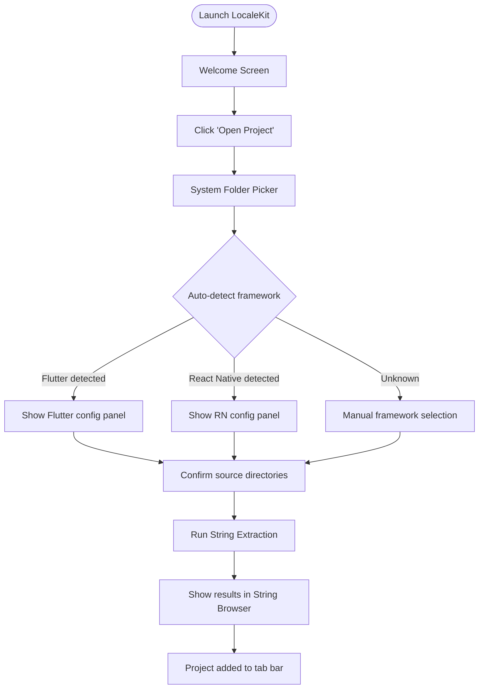
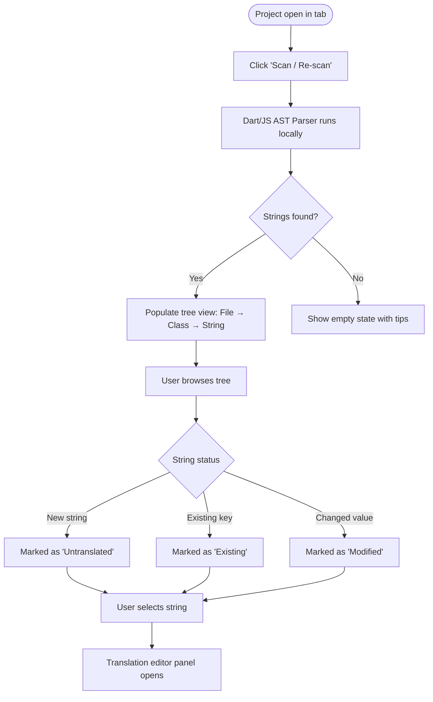
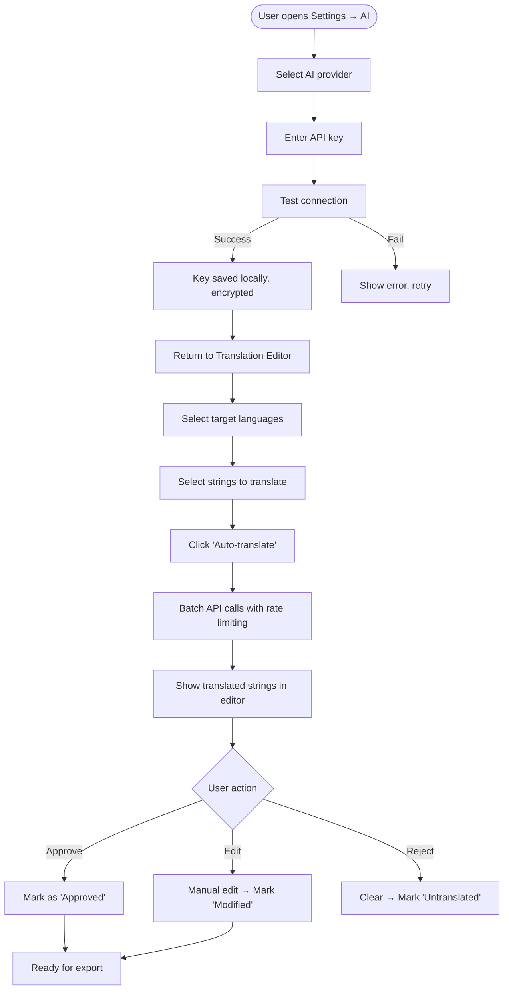
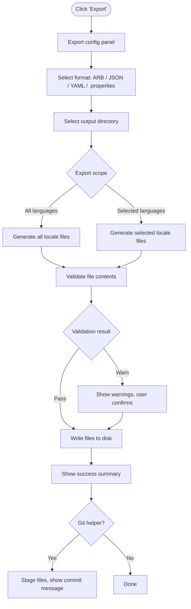
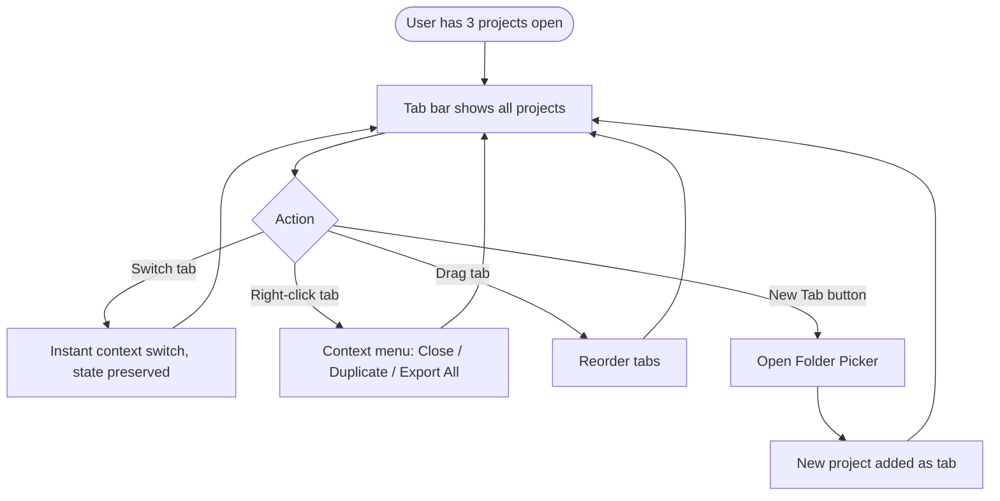

# LocaleKit — Product Requirements Document

> **Suggested name:** `LocaleKit` (over "FlutterI18n Desktop")
> **Rationale:** Framework-agnostic branding, memorable, clearly communicates purpose. Alternative names considered: *PolyglotStudio*, *i18n Forge*, *StringWeave*.

**Version:** 0.1.0-draft  
**License:** MIT  
**Author:** Open Source Community  
**Last Updated:** February 2026  
**Status:** Pre-MVP Planning

---

## Table of Contents

1. [Product Overview](#1-product-overview)
2. [Goals & Success Metrics](#2-goals--success-metrics)
3. [Target Audience](#3-target-audience)
4. [Key Features](#4-key-features)
5. [User Flows](#5-user-flows)
6. [Technical Requirements](#6-technical-requirements)
7. [UI/UX Design](#7-uiux-design)
8. [Data & File Formats](#8-data--file-formats)
9. [Tech Stack](#9-tech-stack)
10. [Non-Functional Requirements](#10-non-functional-requirements)
11. [Monetization & Sustainability](#11-monetization--sustainability)
12. [Risks & Mitigations](#12-risks--mitigations)
13. [Roadmap](#13-roadmap)
14. [Appendix](#14-appendix)

---

## 1. Product Overview

Internationalizing a mobile or web application is one of the most tedious parts of the development lifecycle. Developers must manually hunt for hardcoded strings scattered across hundreds of files, assign them unique keys, create locale files (ARB, JSON, YAML), and then either pay for professional translation services or awkwardly copy-paste content into browser-based tools. No dedicated, standalone desktop application exists that handles the full pipeline — from string extraction to AI-assisted translation to final export — in a single offline-first workflow.

**LocaleKit** is a free, open-source desktop application built with Flutter and Dart that brings the entire i18n workflow under one roof. It scans your project folder locally, identifies every hardcoded or translatable string using AST parsing and regex, lets you browse and manage them in a clean GUI, and leverages user-supplied AI API keys (Gemini, OpenAI, Anthropic) to auto-translate into any language. The tool runs fully offline for all scanning and editing; AI calls are opt-in. It supports Flutter, React Native, and plain JavaScript/TypeScript projects simultaneously via a tabbed multi-project interface. LocaleKit is aimed at indie developers, small teams, and open-source maintainers who need a powerful i18n workflow without SaaS pricing or cloud lock-in.

---

## 2. Goals & Success Metrics

### Primary Goals

- Eliminate the manual drudgery of string extraction and locale file management.
- Provide AI-accelerated translation as a first-class, privacy-respecting feature (user owns their API key).
- Establish LocaleKit as the go-to open-source desktop i18n tool for Flutter and cross-framework projects.

### Success Metrics (KPIs)

| Metric | 3-Month Target | 6-Month Target | 12-Month Target |
|---|---|---|---|
| GitHub Stars | 300 | 1,200 | 3,500 |
| Total Downloads (all platforms) | 500 | 3,000 | 10,000 |
| Active Monthly Users (estimated via telemetry opt-in) | 100 | 800 | 2,500 |
| Issues Opened (community engagement) | 30 | 150 | 400 |
| Supported Frameworks | 2 (Flutter, RN) | 4 | 6 |
| Supported Export Formats | 4 (ARB, JSON, YAML, .properties) | 6 | 8 |
| Contributor Count | 1 | 5 | 20 |
| Open Collective / GitHub Sponsors MRR | $0 | $100 | $400 |

### Quality Metrics

- String extraction accuracy ≥ 95% on standard Flutter projects (measured on sample corpus).
- Translation round-trip (extract → translate → export) completes in under 60 seconds for a 500-string project.
- App cold-start time under 2 seconds on a modern machine.
- Crash rate (opt-in Sentry) < 0.5% of sessions.

---

## 3. Target Audience

### Primary Users

| Persona | Description | Key Pain Points |
|---|---|---|
| **Indie Flutter Developer** | Solo dev building apps for global markets, no i18n tooling budget | Manual ARB file management, copy-pasting into Google Translate |
| **Small Mobile Team (2–10 devs)** | Building Flutter or React Native apps, managing 3–10 locales | No shared workflow, inconsistent key naming, lost strings across PRs |
| **Open Source Maintainer** | Maintaining a popular Flutter package or app with contributor translators | No way to batch-extract and distribute translation tasks without custom scripts |
| **Freelance Developer** | Handles multiple client projects across Flutter and web | Context-switching between frameworks and tools kills productivity |

### Secondary Users

| Persona | Description |
|---|---|
| **Technical Translator** | Fluent in 2+ languages, receives CSV/JSON files from devs to translate |
| **DevOps / Build Engineer** | Wants LocaleKit integrated into CI pipelines via CLI |

### Framework Coverage

- **Flutter / Dart** (primary focus, deepest parsing support)
- **React Native** (JavaScript / TypeScript)
- **Vue.js / Nuxt** (vue-i18n, `$t()` pattern)
- **Next.js / React** (next-i18next, `t()` pattern)
- **Vanilla JS / TS** (custom `t()` wrapper patterns)

---

## 4. Key Features

### MVP (Months 1–3)

| # | Feature | User Story |
|---|---|---|
| M1 | **Project Folder Selection** | As a developer, I want to open any project folder so LocaleKit can scan it without any config file required. |
| M2 | **Auto Framework Detection** | As a user, I want LocaleKit to automatically identify whether my project is Flutter, React Native, or JS so I don't have to configure a parser. |
| M3 | **String Extraction Engine** | As a developer, I want all hardcoded strings in my codebase extracted into a browsable list so I don't miss any. |
| M4 | **String Browser (Tree View)** | As a user, I want to browse extracted strings organized by file and class so I can navigate large codebases easily. |
| M5 | **Translation Editor** | As a developer, I want to add target languages and edit translations in a spreadsheet-like editor side-by-side with the source string. |
| M6 | **AI Translation (API key)** | As a developer, I want to provide my own Gemini/OpenAI/Anthropic key and auto-translate all strings in one click, saving hours of manual work. |
| M7 | **Export to i18n Files** | As a developer, I want to export translations to ARB, JSON, or YAML format with proper structure, ready to drop into my project. |
| M8 | **Multi-project Tabs** | As a freelancer, I want to have 5+ projects open simultaneously in tabs so I can switch context without reopening folders. |
| M9 | **Local-first / Offline mode** | As a developer in a low-connectivity area, I want all scanning and editing to work without internet, with AI as an optional enhancement. |

### Phase 2 (Months 4–6)

| # | Feature | User Story |
|---|---|---|
| P1 | **Source Code Refactoring** | As a developer, I want LocaleKit to replace hardcoded strings in my source files with the generated i18n keys automatically. |
| P2 | **Git Commit Helper** | As a developer, I want a one-click "commit i18n changes" that stages locale files and source changes with a conventional commit message. |
| P3 | **Translation Memory / Cache** | As a user, I want previously translated strings cached locally so I don't waste API tokens re-translating identical strings across projects. |
| P4 | **Plural & Interpolation Support** | As a developer, I want LocaleKit to detect plural forms and variable interpolation patterns and handle them correctly during translation. |
| P5 | **Search & Filter** | As a user, I want to filter strings by status (untranslated, modified, approved) and search by key or value. |
| P6 | **Batch Operations** | As a team lead, I want to select 50 strings and batch-translate, approve, or export them in one action. |
| P7 | **Import Existing Locale Files** | As a developer with partial translations, I want to import existing ARB/JSON files so LocaleKit merges them with newly extracted strings. |

### Nice-to-have (v2.0+)

| # | Feature |
|---|---|
| N1 | CLI mode (`localekit extract --path ./myapp --export arb`) for CI pipelines |
| N2 | VS Code Extension companion (open string in LocaleKit from IDE) |
| N3 | Contributor Export: share a `.lckit` bundle with a translator who doesn't have the codebase |
| N4 | Translation QA: detect missing interpolation variables, length violations, RTL language issues |
| N5 | Plugin API: allow custom framework parsers via Dart plugins |
| N6 | Cloud sync (opt-in, paid tier) for team sharing of translation memory |
| N7 | Figma plugin integration: extract strings from design files |

---

## 5. User Flows

### Flow 1: First-Time Project Setup



### Flow 2: String Extraction & Review



### Flow 3: AI-Assisted Translation



### Flow 4: Export i18n Files



### Flow 5: Multi-Project Management



---

## 6. Technical Requirements

### 6.1 Flutter Desktop App Specifics

- **Minimum Flutter SDK:** 3.19+ (stable channel)
- **Dart SDK:** 3.3+ (required for patterns, records, and sealed classes)
- **Platform targets:** macOS 12+, Windows 10+, Ubuntu 20.04+
- **Window management:** Multi-window not required for MVP; single window with tab-based layout
- **File system access:** Uses `dart:io` directly (no sandboxing limitations on Windows/Linux; macOS requires entitlements for folder access outside sandbox)
- **Local storage:** SQLite via `drift` package for project state, translation memory, and settings
- **App data directory:** Uses `path_provider` to resolve platform-specific config/cache folders

### 6.2 String Extraction Logic

#### Flutter / Dart Projects

Primary parsing strategy: **Dart AST traversal** using the `analyzer` package.

Patterns detected:
```
// Direct string literals in widget trees (heuristic: adjacent to Text(), label:, hint:)
Text('Hello world')
TextFormField(hintText: 'Enter your email')

// Existing i18n wrappers (re-extraction/merge)
AppLocalizations.of(context).welcomeMessage
tr('some.key')           // easy_localization
'key'.tr()              // GetX
S.of(context).title     // flutter_intl / intl
```

AST walk strategy:
1. Parse each `.dart` file into an AST using `package:analyzer`.
2. Visit `StringLiteral` nodes that are arguments to known widget constructors or annotated parameters.
3. Flag strings with length > 2, non-numeric, and not matching common non-translatable patterns (URLs, hex colors, asset paths, format specifiers).
4. Extract: raw value, file path, line number, surrounding context (30 chars), parent node type.

#### React Native / JavaScript / TypeScript Projects

Parsing strategy: **Regex with structural heuristics** (full AST via `dart:ffi` + tree-sitter is complex; regex covers 95% of real-world cases for MVP).

Patterns detected:
```js
t('key')                     // i18next
i18n.t('namespace:key')      // i18next namespaced
$t('key')                    // Vue i18n
<Trans i18nKey="myKey" />    // React Trans component
translate('key')             // generic
```

Regex fallback for raw strings (heuristic):
```
// Detect string literals NOT inside import/require, JSX attribute assignments
// that look like UI copy (length > 3, contains spaces or proper casing)
```

#### Detection Heuristics (All Frameworks)

| Signal | Weight | Notes |
|---|---|---|
| Contains spaces | High | UI copy usually has spaces |
| Starts with capital letter | Medium | Sentence-case suggests UI text |
| Length > 4 chars | Medium | Filters out icon names, single chars |
| Inside Text / label / title | High | Strong widget context signal |
| Matches URL/email pattern | Negative | Exclude programmatic strings |
| Matches path pattern (`/`, `\`) | Negative | Exclude file paths |
| All lowercase, no spaces | Negative | Likely a key or code value |

### 6.3 Supported File Formats

| Format | Extension | Frameworks | Read | Write |
|---|---|---|---|---|
| Flutter ARB | `.arb` | Flutter / intl | ✅ | ✅ |
| JSON (flat) | `.json` | React Native, i18next | ✅ | ✅ |
| JSON (nested) | `.json` | Vue i18n, Next.js | ✅ | ✅ |
| YAML | `.yaml`, `.yml` | Rails i18n, custom | ✅ | ✅ |
| Java Properties | `.properties` | Android, Java apps | ✅ | ✅ |
| PO/POT (Gettext) | `.po`, `.pot` | Web, Python, PHP | ❌ MVP | ✅ v2 |
| XLIFF | `.xliff` | Apple, enterprise | ❌ MVP | ✅ v2 |
| CSV (export only) | `.csv` | Human translators | ❌ MVP | ✅ v2 |

### 6.4 AI API Integration

#### Supported Providers (MVP)

| Provider | Model | API Endpoint |
|---|---|---|
| Google Gemini | `gemini-1.5-flash`, `gemini-1.5-pro` | `https://generativelanguage.googleapis.com/v1beta/` |
| OpenAI | `gpt-4o-mini`, `gpt-4o` | `https://api.openai.com/v1/chat/completions` |
| Anthropic | `claude-haiku-4-5`, `claude-sonnet-4-6` | `https://api.anthropic.com/v1/messages` |

#### API Key Management

- Keys stored in OS keychain via `flutter_secure_storage`.
- Never written to plain text files or committed to git.
- Per-provider key configuration; user can have multiple providers configured simultaneously.
- "Test connection" button validates key before use.

#### Translation Strategy

- **Batch mode:** Up to 50 strings sent per API request to minimize calls. Strings packaged as JSON arrays in the prompt.
- **System prompt template:** Instructs the model to act as a professional translator, maintain placeholders (`{name}`, `%s`, `@count`), preserve HTML tags, and return valid JSON only.
- **Rate limiting:** Configurable delay between requests (default: 500ms) to avoid hitting provider rate limits.
- **Offline cache:** SQLite table caches `(source_text, source_lang, target_lang, provider, translated_text)` keyed by hash. Identical strings are never re-translated.
- **Manual fallback:** User can always type translations directly; AI is always optional.

#### Prompt Template Example

```
You are a professional software localization expert. Translate the following UI strings 
from {sourceLang} to {targetLang}. Rules:
1. Return ONLY valid JSON array with translated strings in the same order.
2. Preserve all placeholders: {variable}, %s, %d, @count, <br/>.
3. Use natural, concise language appropriate for mobile/web UI.
4. Do not translate: URLs, email addresses, brand names, technical keys.

Input: {jsonArrayOfStrings}
```

---

## 7. UI/UX Design

### Design Principles

- **Density-aware:** Developer tools need information density; avoid excessive whitespace.
- **Keyboard-first:** All primary actions reachable via keyboard shortcuts.
- **Dark mode default** with light mode toggle; respects system preference.
- **Minimal chrome:** No splash screens, no onboarding modals on re-launch.

### Screen Descriptions

#### Screen 1: Welcome / Dashboard (first launch only)

A centered empty-state card with the LocaleKit logo, a prominent "Open Project Folder" button, and a "Recent Projects" list below. Keyboard shortcut `Cmd/Ctrl+O` triggers folder picker. Once a project is opened, this screen is replaced by the main workspace.

#### Screen 2: Main Workspace (primary view)

```
┌─────────────────────────────────────────────────────────────────────┐
│  LocaleKit  [File] [Edit] [View] [Tools] [Help]          [⚙ Settings]│
├─────────────────────────────────────────────────────────────────────┤
│ [ProjectA ×] [ProjectB ×] [ProjectC ×] [+]                          │
├──────────────────┬──────────────────────────────────────────────────┤
│ STRING BROWSER   │  TRANSLATION EDITOR                               │
│                  │                                                    │
│ 🔍 [search...]  │  Source (en):  "Welcome back, {name}!"            │
│                  │                                                    │
│ ▼ lib/           │  ┌─────────┬──────────────────────────┬────────┐ │
│   ▼ screens/     │  │ Locale  │ Translation              │ Status │ │
│     home.dart    │  ├─────────┼──────────────────────────┼────────┤ │
│       • Welcome… │  │ fr      │ Bienvenue, {name} !      │ ✅     │ │
│       • Sign in  │  │ es      │ Bienvenido, {name}!      │ ✅     │ │
│     auth.dart    │  │ de      │ [untranslated]            │ 🔴     │ │
│       • Email    │  │ ar      │ [untranslated]            │ 🔴     │ │
│       • Password │  └─────────┴──────────────────────────┴────────┘ │
│   ▼ widgets/     │                                                    │
│     button.dart  │  [🤖 Auto-translate selected] [✅ Approve all]    │
│                  │                                                    │
│ [📊 142 strings] │  Context: home.dart:34 — Text(...)                │
│ [🔴 38 missing]  │  ┌──────────────────────────────────────┐         │
│ [🟡 12 modified] │  │  Text(AppLocalizations.of(context)   │         │
│                  │  │       .welcomeMessage)               │         │
│                  │  └──────────────────────────────────────┘         │
└──────────────────┴──────────────────────────────────────────────────┘
```

**Left Pane — String Browser Tree:**
- Collapsible file tree showing `project → directory → file → string`.
- Color-coded badges: green (translated), red (missing), yellow (modified), gray (ignored).
- Right-click context menu: Ignore string, Assign custom key, Copy value.
- Bottom status bar shows string counts by status.

**Right Pane — Translation Editor:**
- Source string displayed prominently at top with detected interpolation variables highlighted.
- Table with columns: Locale, Translation (editable inline), Status (icon).
- Inline editing: click any cell to edit directly; Tab to move to next cell.
- Below table: source code context snippet (read-only, syntax-highlighted).
- Action bar: "Auto-translate" (selected rows or all), "Approve all", "Export".

#### Screen 3: Settings Panel (modal or side sheet)

Organized in tabs:
- **General:** Theme, language, telemetry opt-in/out.
- **AI Providers:** Per-provider API key input (masked), model selector, test button, rate limit config.
- **Extraction Rules:** Custom regex patterns, ignore patterns (glob), min string length.
- **Export Defaults:** Default format per framework, output path template, key naming convention (camelCase, snake_case, dot.notation).
- **Keyboard Shortcuts:** Customizable shortcut map.

#### Screen 4: Export Dialog

- Format selector (radio buttons with icons).
- Output directory path picker.
- Preview: shows a collapsible tree of files that will be written.
- Option: "Also update source code with i18n keys" (Phase 2).
- Git helper toggle: "Stage changes after export."
- "Export" button with progress indicator.

---

## 8. Data & File Formats

### Input Project Structures

**Flutter:**
```
my_flutter_app/
├── lib/
│   ├── l10n/
│   │   └── app_en.arb          ← existing translations (imported)
│   └── main.dart, screens/, widgets/
├── pubspec.yaml                 ← framework detection signal
└── l10n.yaml                   ← flutter_intl config (optional)
```

**React Native:**
```
my_rn_app/
├── src/
│   └── screens/, components/
├── translations/
│   └── en.json                  ← existing translations
├── package.json                 ← framework detection signal
└── i18n.js
```

**Next.js:**
```
my_next_app/
├── public/locales/
│   └── en/common.json
├── src/ or pages/
└── next.config.js               ← detection signal
```

### Output File Structures

**ARB (Flutter):**
```json
{
  "@@locale": "fr",
  "welcomeMessage": "Bienvenue, {name} !",
  "@welcomeMessage": {
    "description": "Welcome message on home screen",
    "placeholders": {
      "name": { "type": "String" }
    }
  }
}
```

**Flat JSON:**
```json
{
  "welcome_message": "Bienvenue, {name} !",
  "sign_in_button": "Se connecter",
  "error_email_invalid": "Adresse e-mail invalide"
}
```

**Nested JSON:**
```json
{
  "auth": {
    "signIn": "Se connecter",
    "errors": {
      "emailInvalid": "Adresse e-mail invalide"
    }
  }
}
```

### LocaleKit Internal Database Schema (SQLite via Drift)

```sql
-- Projects
CREATE TABLE projects (
  id TEXT PRIMARY KEY,
  name TEXT NOT NULL,
  path TEXT NOT NULL UNIQUE,
  framework TEXT NOT NULL,
  last_scanned INTEGER,
  settings_json TEXT
);

-- Extracted strings
CREATE TABLE strings (
  id TEXT PRIMARY KEY,
  project_id TEXT NOT NULL,
  key TEXT,
  source_value TEXT NOT NULL,
  file_path TEXT NOT NULL,
  line_number INTEGER,
  context_snippet TEXT,
  status TEXT DEFAULT 'untranslated', -- untranslated|translated|approved|ignored
  FOREIGN KEY (project_id) REFERENCES projects(id)
);

-- Translations
CREATE TABLE translations (
  id TEXT PRIMARY KEY,
  string_id TEXT NOT NULL,
  locale TEXT NOT NULL,
  value TEXT,
  status TEXT DEFAULT 'pending', -- pending|auto|manual|approved
  provider TEXT,
  updated_at INTEGER,
  FOREIGN KEY (string_id) REFERENCES strings(id),
  UNIQUE(string_id, locale)
);

-- Translation memory cache
CREATE TABLE translation_memory (
  hash TEXT PRIMARY KEY, -- SHA256 of (source_text + source_lang + target_lang)
  source_text TEXT NOT NULL,
  translated_text TEXT NOT NULL,
  provider TEXT NOT NULL,
  created_at INTEGER NOT NULL
);
```

---

## 9. Tech Stack

### Core Framework

| Component | Technology | Version |
|---|---|---|
| UI Framework | Flutter Desktop | 3.19+ (stable) |
| Language | Dart | 3.3+ |
| State Management | Riverpod | ^2.5 |
| Navigation | go_router | ^13.0 |
| Local Database | drift (SQLite) | ^2.18 |

### Dart Packages

| Package | Purpose | Pub.dev |
|---|---|---|
| `analyzer` | Dart AST parsing for Flutter projects | `^6.4` |
| `http` | AI API HTTP calls | `^1.2` |
| `file_picker` | OS-native folder/file picker | `^8.0` |
| `flutter_secure_storage` | OS keychain for API keys | `^9.0` |
| `path_provider` | Platform-aware app data paths | `^2.1` |
| `path` | Path manipulation utilities | `^1.9` |
| `drift` + `drift_flutter` | SQLite ORM for local data | `^2.18` |
| `riverpod` + `flutter_riverpod` | Reactive state management | `^2.5` |
| `go_router` | Declarative routing | `^13.0` |
| `re_highlight` | Syntax highlighting (context preview) | `^0.0.4` |
| `freezed` + `json_serializable` | Immutable models + JSON | `^2.4` |
| `yaml` | YAML parse/emit | `^3.1` |
| `archive` | ZIP for `.lckit` bundle export | `^3.5` |
| `crypto` | SHA256 for translation memory cache keys | `^3.0` |
| `intl` | ICU message format parsing (plurals) | `^0.19` |
| `shared_preferences` | Simple key-value prefs | `^2.2` |
| `url_launcher` | Open docs/links in browser | `^6.2` |
| `window_manager` | Desktop window title/size control | `^0.3` |

### Development Tools

| Tool | Purpose |
|---|---|
| `build_runner` | Code generation (freezed, drift, riverpod_generator) |
| `flutter_test` | Unit and widget tests |
| `mocktail` | Mocking in tests |
| `very_good_analysis` | Strict lint rules |
| GitHub Actions | CI: test, build binaries for all 3 platforms |

### AI API Integration Architecture

```
[User selects "Auto-translate"]
        │
        ▼
[TranslationService (Dart)]
        │
        ├── [GeminiAdapter]  → Google REST API
        ├── [OpenAIAdapter]  → OpenAI REST API  
        └── [AnthropicAdapter] → Anthropic REST API
        
All adapters implement:
  abstract class AITranslationAdapter {
    Future<List<String>> translateBatch(
      List<String> strings, String targetLocale, {String? systemHint}
    );
  }
```

---

## 10. Non-Functional Requirements

### Performance

| Requirement | Target |
|---|---|
| Cold start time | < 2 seconds |
| Project scan (1,000 files) | < 15 seconds |
| String extraction (500 strings) | < 5 seconds |
| UI frame rate during scan | ≥ 60fps (scan runs in Dart Isolate) |
| Memory usage (3 projects open) | < 300MB RAM |
| SQLite query response | < 50ms for typical queries |

### Security

- API keys stored exclusively in OS keychain (`flutter_secure_storage`); never in plain `.json`, `.env`, or SQLite.
- No telemetry by default; opt-in only with clear disclosure.
- No network calls except user-initiated AI translation or update checks.
- All file operations strictly within user-selected directories; no arbitrary filesystem access.

### Privacy & Data

- All project data (strings, translations, settings) stored locally on user's machine.
- Translation memory is local-only in the open-source version.
- Source code is never uploaded to any server; only individual strings are sent to AI APIs (with user's own key and consent).

### Offline-First

- 100% of core functionality (scan, browse, edit, export) works without internet.
- AI translation gracefully degrades to "AI offline" state with manual input mode.
- App must function in air-gapped environments (no analytics pings, no license checks).

### Accessibility

- Full keyboard navigation (Tab, Arrow keys, Escape) throughout.
- WCAG AA contrast ratios in both light and dark themes.
- Screen reader support via Flutter's Semantics API (labels on all interactive elements).
- Configurable font size (small / medium / large).
- No animations that cannot be disabled for motion-sensitive users.

### Reliability

- Crash recovery: unsaved translation edits auto-saved to SQLite every 30 seconds.
- Atomic file writes: export uses temp file + rename to prevent partial writes on crash.
- Graceful degradation on malformed source files (log error, skip file, continue scan).

---

## 11. Monetization & Sustainability

LocaleKit is MIT-licensed and will remain free forever for all core features. Sustainability is built around community support and optional value-added tiers.

### Funding Model

| Channel | Description | Target MRR |
|---|---|---|
| **GitHub Sponsors** | Individual developer donations | $50–$200 |
| **Open Collective** | Team/company sponsorships with logo on README | $100–$500 |
| **Ko-fi / Buy Me a Coffee** | One-time contributions | Variable |
| **LocaleKit Cloud (future)** | Optional SaaS layer for team sync (separate product) | $0 MVP |

### What Stays Free (Always)

- All scanning, extraction, editing, and export features.
- All AI provider integrations (user's own key).
- Multi-project support.
- All platform binaries (macOS, Windows, Linux).

### Potential Premium Features (v2.0+, separate tier)

| Feature | Rationale |
|---|---|
| Cloud translation memory (shared across team) | Requires server infrastructure |
| Hosted AI translation (no own API key needed) | Requires Anthropic API spend |
| Team collaboration (real-time co-editing) | Requires backend |
| Priority support / SLA | Time investment |

---

## 12. Risks & Mitigations

| Risk | Probability | Impact | Mitigation |
|---|---|---|---|
| **Dart `analyzer` package complexity** — AST traversal has steep learning curve and may miss edge cases | High | Medium | Start with regex fallback; incrementally improve AST coverage; write a corpus of test Dart files |
| **Framework fragmentation** — React Native/Vue/Next.js each have different i18n patterns | High | Medium | Focus Flutter support for MVP; add others via community-contributed adapters post-launch |
| **AI provider API changes** — OpenAI/Gemini deprecate models or change response format | Medium | Medium | Adapter pattern isolates provider logic; integration tests mock API responses |
| **macOS sandbox restrictions** — App Store distribution limits file system access | Low | High | Distribute via DMG/Homebrew (not Mac App Store) for MVP; revisit entitlements for v2 |
| **Solo developer burnout** — 3-month solo development is ambitious | High | High | Scope MVP ruthlessly; use GitHub Issues to pre-validate demand; seek co-maintainers early |
| **Performance on monorepos** — Large projects (5,000+ files) may scan slowly | Medium | Medium | Scan in background Dart Isolate; incremental re-scan (only changed files); progress indicator |
| **AI hallucinations in translations** — AI returns malformed JSON or incorrect translations | Medium | Low | Parse AI responses defensively; always show AI output for human review before export; never auto-export |
| **Key naming conflicts** — Auto-generated keys collide with existing i18n keys | Medium | Medium | Detect and warn on conflict; offer rename suggestions; never silently overwrite |

---

## 13. Roadmap

### MVP — v0.1.0 (Month 1–3)

**Goal:** Usable tool for Flutter developers to extract, translate, and export ARB files.

| Month | Milestones |
|---|---|
| **Month 1** | Project setup, Flutter desktop scaffold, file picker + project detection, basic Dart string extraction (regex), SQLite schema, string browser tree UI |
| **Month 2** | Translation editor UI, AI API integration (Gemini + OpenAI), offline cache, ARB + flat JSON export, settings panel with API key management |
| **Month 3** | Multi-project tabs, dark/light theme, macOS + Windows + Linux build pipeline (GitHub Actions), public beta launch, README + docs site |

**MVP exit criteria:**
- Can extract strings from a real-world Flutter project (tested on 3 open-source apps).
- Can translate 100 strings via Gemini with one click.
- Can export valid ARB file that a Flutter app can consume without modification.
- Runs on all 3 platforms without installer dependencies.

### v1.0 (Month 4–6)

- AST-based Dart parsing via `analyzer` package (replaces regex for Flutter).
- React Native support (JS/TS regex parser).
- Source code refactoring (replace hardcoded strings with i18n keys).
- Translation memory (SQLite cache).
- Git commit helper.
- Search, filter, and batch operations.
- Import existing locale files (merge mode).
- Plural and interpolation support.
- Anthropic Claude integration.
- Stability: 95%+ string extraction accuracy on test corpus.

### v2.0 (Month 7–12)

- Vue.js / Next.js support.
- XLIFF and PO/Gettext export.
- CLI mode for CI pipelines.
- CSV export for human translators.
- Translation QA (missing variables, length warnings, RTL checks).
- Plugin API for custom framework parsers.
- VS Code companion extension (optional).
- LocaleKit Cloud (separate, optional SaaS product for teams).

---

## 14. Appendix

### A. Competitor Comparison

| Tool | Type | Flutter Support | AI Translation | Local-first | Price | Open Source |
|---|---|---|---|---|---|---|
| **LocaleKit** | Desktop App | ✅ Native | ✅ (own key) | ✅ | Free | ✅ MIT |
| Localazy | Web SaaS | ✅ (plugin) | ✅ (paid) | ❌ | Freemium ($) | ❌ |
| Phrase (Memsource) | Web SaaS | ✅ (plugin) | ✅ (paid) | ❌ | Expensive ($$$$) | ❌ |
| Crowdin | Web SaaS | ✅ | ✅ (paid) | ❌ | Freemium ($$) | ❌ |
| POEditor | Web SaaS | ✅ | Partial | ❌ | $ | ❌ |
| Weblate | Self-hosted | ✅ | ❌ | ✅ | Free (self-host) | ✅ |
| i18n Ally (VS Code) | IDE Plugin | ✅ | ❌ | ✅ | Free | ✅ |
| Linguist (GitHub) | Web | ❌ | ❌ | ❌ | Free | ✅ |
| flutter_gen + manual | CLI + manual | ✅ | ❌ | ✅ | Free | ✅ |

**LocaleKit's unique position:** Only tool that combines desktop-native UX + local-first privacy + AI translation with user's own key + Flutter-native parsing + free/open-source.

### B. Sample String Extraction Regex Patterns

**Flutter / Dart — heuristic string detection (fallback):**
```dart
// Regex: matches string literals in common widget arguments
// Text('...'), hintText: '...', label: '...', tooltip: '...'
final pattern = RegExp(
  r'''(?:Text|hintText|labelText|tooltip|semanticsLabel|title)\s*[:(]\s*['"]([^'"]{3,200})['"]''',
  multiLine: true,
);
```

**React Native / i18next:**
```js
// t('key') or t("key") or i18n.t('key')
/(?:^|\W)(?:i18n\.)?t\(['"]([a-zA-Z0-9_.:-]+)['"]\)/gm

// Trans component
/<Trans\s+i18nKey=['"]([^'"]+)['"]/gm
```

**Vue i18n:**
```js
// $t('key') in templates, this.$t('key') in script
/\$t\(['"]([^'"]+)['"]\)/gm
```

**Non-translatable string filters (exclude these patterns):**
```dart
// Exclude: URLs, hex colors, asset paths, format strings, single words
final excludePatterns = [
  RegExp(r'^https?://'),
  RegExp(r'^#[0-9a-fA-F]{3,8}$'),
  RegExp(r'^assets/'),
  RegExp(r'^\d+(\.\d+)?$'),
  RegExp(r'^[a-z_]+$'),         // snake_case → likely a key, not copy
  RegExp(r'package:'),
];
```

### C. Key Naming Convention Options

| Convention | Example Key | Notes |
|---|---|---|
| `snake_case` | `welcome_message` | Default; broadly compatible |
| `camelCase` | `welcomeMessage` | Common in JS projects |
| `dot.notation` | `home.welcome.message` | i18next namespaced style |
| `SCREAMING_SNAKE` | `WELCOME_MESSAGE` | Some Android conventions |

### D. Environment / Build Requirements

```yaml
# pubspec.yaml excerpt
environment:
  sdk: '>=3.3.0 <4.0.0'
  flutter: '>=3.19.0'

flutter:
  desktop:
    - windows
    - macos
    - linux
```

GitHub Actions matrix:
```yaml
strategy:
  matrix:
    os: [ubuntu-latest, windows-latest, macos-latest]
    include:
      - os: ubuntu-latest
        artifact: localekit-linux-x64.tar.gz
      - os: windows-latest
        artifact: localekit-windows-x64.zip
      - os: macos-latest
        artifact: localekit-macos-universal.dmg
```

### E. Glossary

| Term | Definition |
|---|---|
| ARB | Application Resource Bundle; Flutter's standard i18n file format |
| AST | Abstract Syntax Tree; structured representation of source code for parsing |
| i18n | Internationalization (18 letters between 'i' and 'n') |
| l10n | Localization |
| ICU | International Components for Unicode; standard for plural/select message formatting |
| Translation Memory | Database of previously translated strings to avoid re-translating duplicates |
| Locale | Language + region identifier (e.g., `fr_FR`, `en_US`, `ar`) |
| Interpolation | Dynamic variables embedded in strings (e.g., `"Hello, {name}!"`) |

---

*LocaleKit is an open-source project. Contributions welcome. See CONTRIBUTING.md.*  
*License: MIT — free to use, modify, and distribute.*  
*Built with ❤️ and Flutter.*
